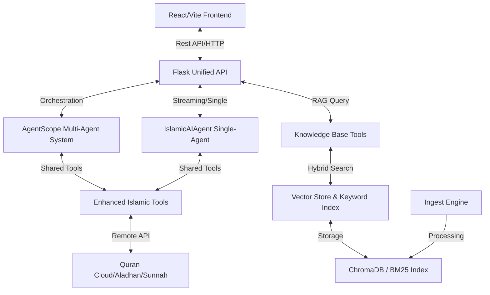
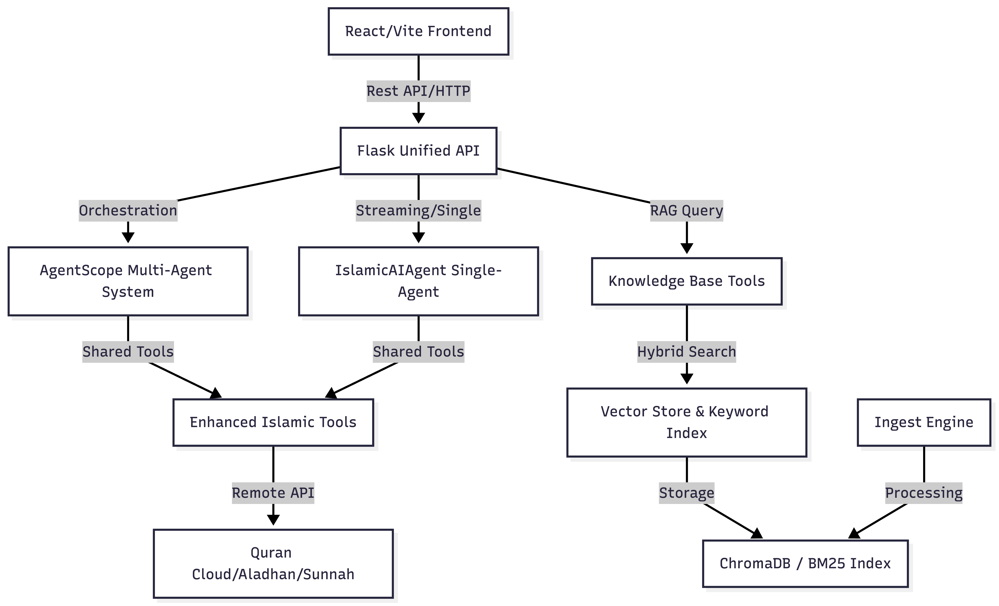
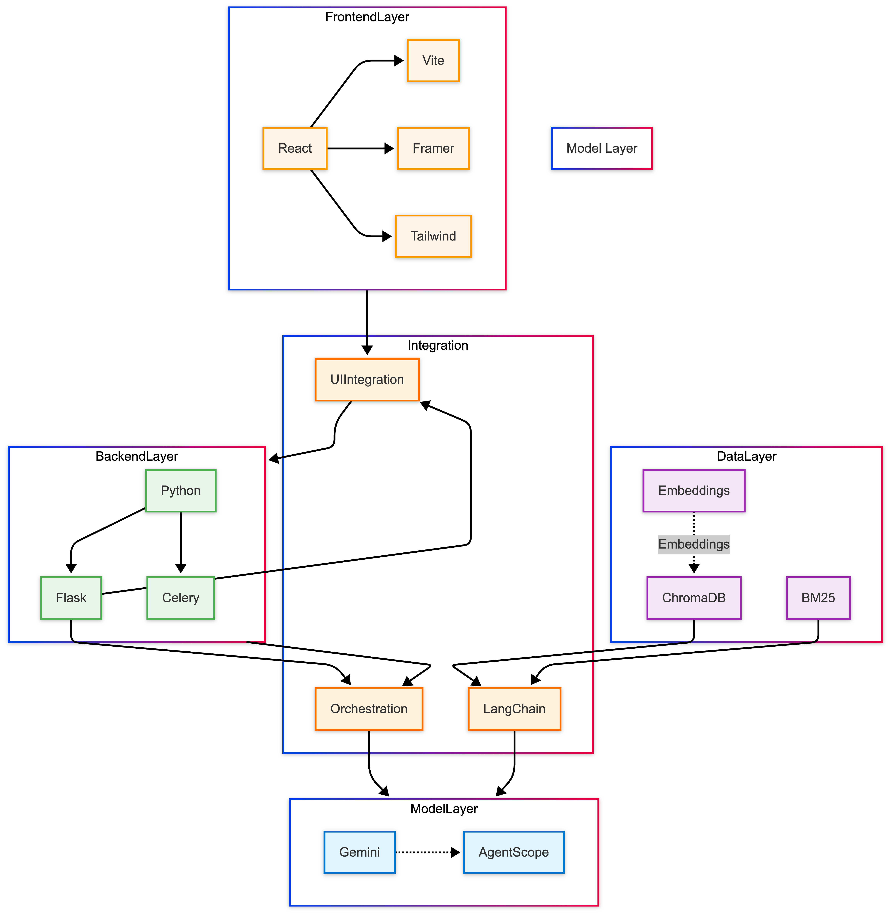

# Architecture Overview - Islamic AI Agent

This document provides a high-level technical overview of how the **Noor** Islamic AI Agent integrates its various components to deliver an authentic scholarly experience.

## 🧱 Component Block Diagram

## 🔄 Interaction Flows

### 1. Unified RAG Retrieval
When a query is submitted, the system performs a multi-stage retrieval:
1.  **Semantic Retrieval**: ChromaDB (vector) searches for contextually relevant chunks using `multilingual-e5-large`.
2.  **Keyword Retrieval**: BM25 (keyword) searches for exact matches (e.g., "Surah 17:78").
3.  **Hybrid Reranking**: FlashRerank (Cross-Encoder) sorts the top candidates from both sources to ensure the most pinpoint accurate reference is prioritized.

### 2. Multi-Agent Deliberation
For complex "Scholar Consultation," the system activates a team of specialized agents:
1.  **Coordinator (Imam Hassan)**: Routes the query to relevant specialists.
2.  **Specialists (Sheikh Abdullah, Sheikha Aisha, etc.)**: Analyze the query and provide domain-specific evidence.
3.  **Synthesis**: Imam Hassan consolidates the different perspectives into a final, unified response with "Museum Grade" citations.

### 3. Real-Time Scholarly Content
The `Enhanced Islamic Tools` bridge the static knowledge base with real-time religious data:
- **Quranic Engine**: Fetches Arabic text and translations on-the-fly.
- **Prayer & Qibla**: Geospatial calculations via global religious APIs.
- **Halal Checker**: Ingredient-based compliance checking from verified datasets.

## 🏗️ Technical Stack Details

| Layer | Technology | Multi-Agent Framework |
| :--- | :--- | :--- |
| **Model** | Google Gemini 2.0 Flash | AgentScope v0.1.6 |
| **Frontend** | React, Vite, Framer Motion, Tailwind CSS | UI Integration via Flask |
| **Backend** | Python, Flask, Celery (Optional) | Multi-Agent Orchestration |
| **Vector DB** | ChromaDB (Vector), BM25 (Keyword) | Integrated via LangChain |
| **Embeddings** | `intfloat/multilingual-e5-large` | Semantic Understanding |

---

> [!NOTE]
> The system is designed for high-concurrency and stateful conversations, maintaining context across multiple steps of a scholarly consultation.
