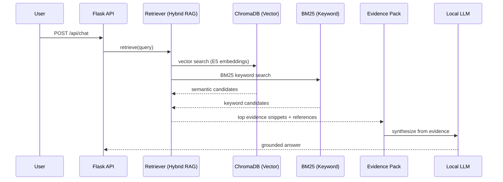

# Knowledge Base Technical Details - Noor (RAG)

Noor’s local Knowledge Base is designed to retrieve reliable evidence (Quran translations, hadith collections, seerah, ethics, duas, etc.) and then let the local LLM write a helpful answer that stays grounded in that evidence.

## Retrieval Pipeline

## Core Components

### 1) Vector Store (semantic)
- Engine: ChromaDB (persistent)
- Embedding model: `intfloat/multilingual-e5-large`
- Purpose: semantic retrieval across Arabic/English/Urdu content

### 2) BM25 (keyword precision)
- Engine: `rank_bm25`
- Purpose: exact matching for references and phrases (e.g., “Bukhari 1160”, “Surah 17:78”)

### 3) Optional reranking
- A reranker may be used when available to improve ordering of candidates.
- Typical model (optional): `BAAI/bge-reranker-v2-m3`

## Ingestion & Pre-processing

### Source folder
- All knowledge files live in: `backend/knowledge/data/`

### Supported file types
- `json`, `txt`, `csv`, `pdf`

### Full ingestion (Chroma + BM25)
- Script: `python3 backend/knowledge/full_data_ingestion.py`
- Outputs:
  - `backend/knowledge/chroma_db_full/` (Chroma persistent store)
  - `backend/knowledge/bm25_full_index.pkl` (BM25 index)

### Auto-ingestion (BM25 updates)
- Service: `backend/knowledge/auto_ingest_service.py`
- Watches the data folder and updates BM25 when new/modified files appear.
- This is designed for quick “drop a file and search it” workflows.

## Reset / Rebuild

If the embedding model or ingestion settings change, rebuild the stores:
1. Stop the backend.
2. Remove the persisted stores:
   - `backend/knowledge/chroma_db_full/`
   - `backend/knowledge/bm25_full_index.pkl`
3. Run full ingestion again:
   - `python3 backend/knowledge/full_data_ingestion.py`
