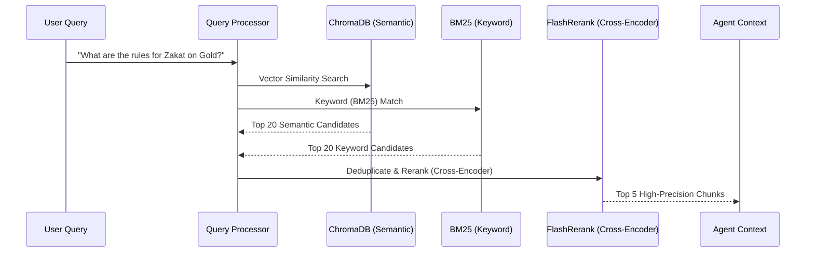

# Knowledge Base Technical Details - Islamic AI Agent

The **Noor** KNOWLEDGE BASE (RAG Engine) is designed for professional-grade semantic search and keyword precision. It ensures that the system's "Scholarly First" priority is upheld by grounding every response in authentic locally-provided texts.

---

## 🏗️ Retrieval Pipeline Architecture

## 🧠 Core Components

### 1. Vector Store (Semantic)
- **Engine**: [ChromaDB](https://www.trychroma.com/)
- **Embedding Model**: `intfloat/multilingual-e5-large`
- **Purpose**: Captures the deep semantic meaning of queries, supporting complex theological and Jurisprudential concepts across multiple languages (Arabic, English, etc.).
- **Dimension**: 1024-dimensional dense vectors.

### 2. BM25 (Keyword Precision)
- **Engine**: `rank_bm25` (Okapi BM25 implementation)
- **Purpose**: Essential for pinpointing specific references like **"Surah 17:78"** or **"Bukhari 1160"** where exact term matching is more reliable than semantic similarity.
- **Normalization**: Tokenized and lowercased using NLTK.

### 3. Cross-Encoder Reranking
- **Engine**: `FlashRerank` (`ms-marco-MiniLM-L-6-v2`)
- **Purpose**: Computes a detailed relevance score between the query and each candidate chunk. This is a computationally intensive step that ensures only the most contextually relevant evidence reaches the AI agent.
- **Filtering**: Only results with a confidence score > 0.3 (adjustable) are passed to the agent.

---

## 📥 Ingestion & Pre-processing

The `ingest_data.py` script handles the lifecycle of scholarly documents:

### 1. Incremental Ingestion
- **Hash-Based Tracking**: MD5 hashes are used to store the state of every file in `ingestion_state.json`. 
- **Efficiency**: Only new or modified files are processed, saving compute and storage costs.

### 2. Scholarly JSON Parsing
Beyond standard PDFs and TXTs, the system specially parses **Authentic Scholarly JSONs**:
- **Hadith Collections**: Maps `narrator`, `hadithnumber`, `grade`, and `text`.
- **Dua/Adhkar (Hisn al-Muslim)**: Groups by category (Morning/Evening) and includes source references.
- **Metadata**: Parses surah names, meanings, and transliterations.

### 3. Chunking Strategy
- **Recursive Character Splitter**: 1200 characters with a 300-character overlap.
- **Separators**: Priority given to paragraph breaks (`\n\n`) to avoid splitting a single Hadith or Verse across multiple chunks.

---

## 📂 Folder Structure

- `/knowledge_base/data/`: Place your authentic PDFs, TXTs, and JSONs here.
- `/knowledge_base/chroma_db/`: Local persistent vector database.
- `/knowledge_base/bm25_index.pkl`: Serialized keyword index.
- `/knowledge_base/local_knowledge_tools.py`: Search and Rerank logic.

---

> [!TIP]
> To reset the knowledge base and force a full re-ingestion, delete the `chroma_db/` folder and `ingestion_state.json`, then run `python3 knowledge_base/ingest_data.py`.
